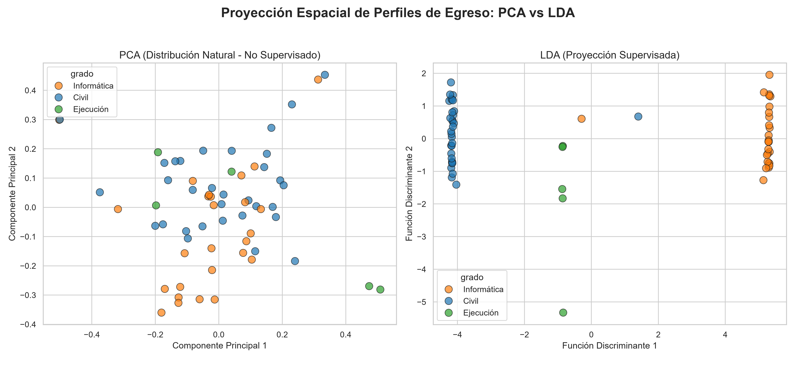
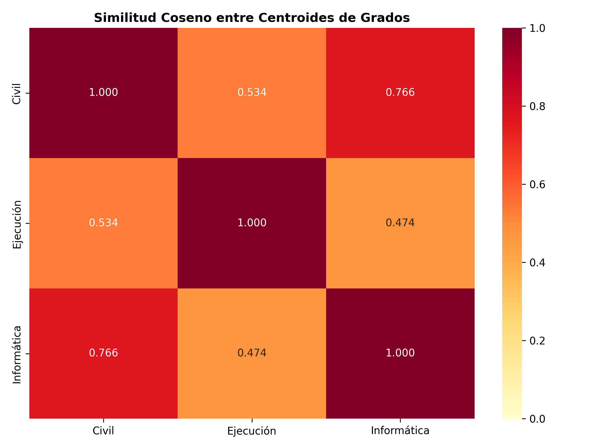

# Descubrimiento de patrones en perfiles de Egreso de Informática mediante Machine Learning

**Proyecto de Título · Universidad de las Américas · Facultad de Ingeniería y Negocios · 2026**  
**Autores:** Brayan Pineda Poblete · Walter Reyes Silva

---

## Resumen Técnico

Pipeline de Ciencia de Datos que extrae, normaliza y clasifica **64 perfiles de egreso** de programas de Informática provenientes de **47 Instituciones de Educación Superior (IES) chilenas**. Mediante NLP (spaCy + TF-IDF) y un benchmark competitivo de Machine Learning, el estudio cuantifica la homogeneidad curricular entre tres grados académicos: Ingeniería Civil Informática, Ingeniería en Informática e Ingeniería de Ejecución.

---

## Modelo

El clasificador ganador es **Random Forest** con un **92.79% de Accuracy** (Validación Cruzada Estratificada, 5-Folds), seleccionado tras un benchmark de **11 algoritmos** optimizados con **SMOTE** para balanceo de clases minoritarias.

---

## Hallazgos Clave

1. **Convergencia léxica del 76.6%** entre Ingeniería Civil e Ingeniería en Informática (Similitud Coseno: 0.7663 sobre centroides TF-IDF).
2. **Identidad léxica única** en Ingeniería de Ejecución: similitud < 50% respecto a los otros dos grados, con vocabulario técnico operacional genuinamente diferenciado.
3. **Validación estadística** mediante Test de Permutación: **p-valor = 0.0000** (hipótesis nula rechazada; la convergencia no es producto del azar).

---

## Visualizaciones

### Proyección 2D PCA vs LDA · Separabilidad entre grados



*PCA (no supervisado): muestra el clúster central de alta densidad entre Civil e Informática, evidenciando la convergencia léxica del 76.6%. LDA (supervisado): maximiza la separabilidad entre clases, con Ejecución aislada como el único grado léxicamente diferenciado.*

---

### Similitud Coseno entre Centroides TF-IDF



*Heatmap de Similitud Coseno sobre centroides TF-IDF. Civil e Informática comparten el 76.6% de vocabulario de competencias (p = 0.0000). Ejecución mantiene similitudes inferiores al 50% frente a ambos grados.*

---

## Estructura del Repositorio

```
Proyecto_Titulo_2026/
├── README.md
├── requirements.txt
├── src/
│   ├── Fase1_Recoleccion/       # Web Scraping híbrido (Requests / Selenium)
│   ├── Fase2_Procesamiento/     # Limpieza lingüística con spaCy
│   ├── Fase3_Analisis/          # Benchmark ML, validación estadística, reportes
│   └── data/
│       └── processed/           # Artefactos finales: modelo .joblib, imágenes .png, resultados.json
└── landing/                     # Landing Page interactiva (Next.js)
```

---

## Ejecución

```bash
# 1. Entorno virtual
python -m venv venv
venv\Scripts\activate          # Windows
pip install -r requirements.txt
python -m spacy download es_core_news_sm

# 2. Pipeline de Ciencia de Datos
python src/Fase1_Recoleccion/main.py
python src/Fase2_Procesamiento/01_limpieza_nlp.py
python src/Fase3_Analisis/01_separabilidad_supervisada.py
python src/Fase3_Analisis/02_proyeccion_lda.py
python src/Fase3_Analisis/03_homogeneidad_significancia.py
python src/Fase3_Analisis/04_diferenciacion_lexica.py
python src/Fase3_Analisis/05_generar_reporte.py

# 3. Landing Page
cd landing
npm install
npm run dev        # http://localhost:3000
```

---

## Stack Tecnológico

| Capa | Tecnologías |
|---|---|
| **Lenguaje** | Python 3.13 |
| **NLP** | spaCy `es_core_news_sm`, TF-IDF, Z-Score (Keyness) |
| **Machine Learning** | Scikit-learn · Random Forest · SMOTE · PCA · LDA · StratifiedKFold |
| **Visualización** | Matplotlib, Seaborn |
| **Frontend** | Next.js 15, TypeScript, Tailwind CSS |

---

*Universidad de las Américas · 2026*
